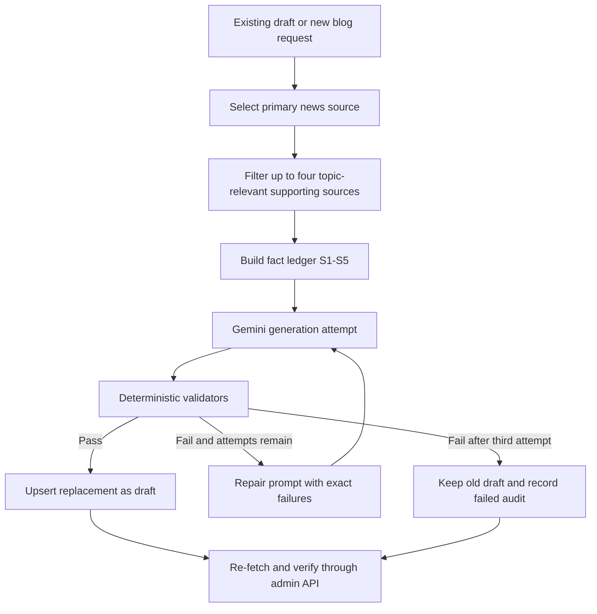

# AI Blog Rule-Based Regeneration

Date: 2026-06-21
Status: Approved design

## Goal

Strengthen the Gemini agriculture-blog pipeline so every generated draft is constrained by deterministic editorial rules, validated independently from Gemini's self-review, and retried with concrete correction feedback before it can replace an existing production draft.

The rollout will re-test and attempt to replace all 19 current `agri_blog` drafts. All 19 audience-specific articles remain distinct records, including multiple articles derived from the same primary news topic.

## Non-Goals

- Do not auto-publish any regenerated article.
- Do not merge or delete the 19 existing audience-specific drafts.
- Do not change the separate export-period, export-monthly, or world-daily-price article flows.
- Do not treat Gemini's SEO score as a pass/fail signal.
- Do not introduce detailed agronomic prescriptions, legal conclusions, investment advice, or trade instructions unsupported by authoritative sources.
- Do not redesign the admin page beyond the minimum metadata needed to show regeneration and validation results.

## Context

Production currently contains 19 draft agriculture blogs generated by Gemini. All 19 have `quality.valid = false`; their average length is about 485 words against the existing 650-word target. Review found recurring failures:

- sources selected because they were recent or broadly agricultural rather than relevant to the article's actual subject;
- unrelated facts mixed into one article, such as coffee forecasts in livestock analysis;
- generic news snippets expanded into technical, legal, or commercial recommendations;
- numeric or policy claims attributed only to a publication name without a clickable source list;
- noisy taxonomy values such as `News`, `Hàng Hóa`, `thi-truong`, and `gia-ca` forced into prose;
- multiple audience versions reusing nearly the same title and argument;
- malformed slugs containing repeated audience tokens;
- Gemini SEO review warning that FAQ was missing even though FAQ metadata existed;
- Gemini SEO review incorrectly disputing the current official name “Bộ Nông nghiệp và Môi trường”;
- high Gemini SEO scores attached to drafts that failed deterministic validation.

The current source builder selects up to five articles using audience signals and freshness. It does not require topical relevance to the primary source. The current validator mainly checks length, headings, raw HTML, broad attribution, audience, and style.

## Recommended Approach

Use a deterministic editorial pipeline around Gemini:

1. Build a topic-specific source pack of up to five articles.
2. Convert the source pack into a bounded fact ledger.
3. Generate a draft under explicit audience and claim rules.
4. Run deterministic structural, lexical, sourcing, safety, and duplication validators.
5. If validation fails, send only the draft, fact ledger, and exact validation failures back to Gemini for correction.
6. Retry at most three total generation attempts.
7. Replace the existing production draft only when every hard gate passes.
8. If all attempts fail, retain the old draft and record the failed regeneration result.

Gemini SEO review remains optional advisory metadata. It cannot make an invalid draft valid or block a draft that passes deterministic gates solely because of a subjective SEO warning.

## Alternatives Considered

### Prompt-only hardening

This is the smallest change, but it cannot reliably prevent source mixing, unsupported claims, malformed keywords, or false self-review warnings. It is rejected because the observed failures require deterministic enforcement.

### Two independent AI editors

A writer model followed by a separate editor model could improve prose, but it increases cost and still cannot guarantee factual containment. It may be reconsidered later, but it is unnecessary for the first hardening pass.

### One article per topic

Merging the Tuyên Quang, Black Thorn, and Philippines variants would reduce SEO overlap. The user explicitly chose to retain all 19 audience-specific articles, so this design instead enforces differentiation.

## Design

### Editorial rule base

The rule base will be represented as named constants and pure validation functions in the AI article service, rather than existing only as prompt prose.

#### Source selection

- Each article may use one to five sources.
- Source 1 is the primary source and must directly match the article topic.
- Sources 2–5 are optional supporting sources.
- A supporting source must share at least one strong topic entity with the primary source:
  - the same commodity or species;
  - the same province or explicitly compared production region;
  - the same named policy, regulation, program, organization, or company;
  - the same concrete supply-chain stage, when the comparison is explicitly identified as a comparison.
- Broad category matches such as “nông nghiệp”, “trồng trọt”, “chăn nuôi”, `News`, freshness, or audience relevance alone are insufficient.
- Sources with no strong match are excluded even when fewer than five sources remain.
- Primary-source selection remains audience-aware, but supporting-source selection is topic-aware first.
- Navigation text, hotline text, page furniture, and trailing widgets are excluded from fact snippets.

#### Fact ledger

Each accepted source is assigned a stable identifier `S1` through `S5`. The prompt receives a structured ledger containing:

- source identifier;
- title;
- publisher/source key;
- publication date;
- canonical URL;
- relevant entities and topic signals;
- exact bounded fact snippets.

The model may use only claims represented by the ledger. Numeric values, dates, named people, official titles, policy names, legal requirements, geographic scope, and status words such as “planned”, “pilot”, “proposed”, and “implemented” must preserve the ledger's meaning.

The generated JSON must include a `claimSources` collection that maps each material factual claim to one or more source identifiers. This enables deterministic checks without relying only on Vietnamese attribution words.

#### Audience boundaries

All 19 articles remain separate, but versions derived from the same primary topic must have distinct reader value.

For `farmer`:

- focus on applicability conditions, production risks, questions to ask extension officers, and safe next steps;
- do not prescribe pesticide, fertilizer, veterinary drug, dosage, irrigation schedule, stocking density, or exact cultivation protocol unless an authoritative technical source in the ledger provides it;
- do not promise yield, profit, suitability, or disease resistance beyond the source.

For `trader`:

- focus on supply, grading, perishability, loss, cold-chain needs, buyer demand, and information to verify before purchasing;
- do not instruct the reader to buy, import, stockpile, or set a margin;
- do not infer profitability from a lower farm-gate or retail price;
- clearly distinguish retail price, wholesale price, farm-gate price, import price, and administrative price ceilings.

For `exporter`:

- focus on documents, traceability, quality controls, contract questions, destination-market requirements, and operational risks;
- do not declare a legal obligation unless the ledger contains an authoritative official source supporting that obligation;
- do not generalize a domestic retail rule into an import-price or customs rule;
- label projections, pilots, proposals, and local examples accurately.

#### Cross-audience differentiation

Articles sharing the same primary source are allowed, but:

- their titles must differ;
- their opening answer summaries must differ;
- their central action sections must address the selected audience;
- no pair may exceed 65% normalized argument or sentence similarity;
- shared factual background is allowed and is excluded from the differentiation requirement where practical;
- if differentiation fails, the retry prompt identifies the overlapping sections and requires an audience-specific rewrite.

#### Structure and language

Every replacement draft must:

- contain 700–1,000 Vietnamese words;
- contain a concise answer summary near the beginning;
- contain at least three meaningful H2 headings;
- contain a practical checklist appropriate to the audience;
- contain a conclusion with safe next steps;
- render at least two FAQ items in the article body and carry matching FAQ metadata;
- contain a “Nguồn tham khảo” section with publisher, article title, publication date, and canonical link for every source actually used;
- use natural Vietnamese rather than inserting taxonomy values as keywords.

Forbidden visible tokens include taxonomy noise and malformed keyword forms such as:

- standalone `News`;
- forced `Hàng Hóa`;
- `thi-truong`;
- `gia-ca`;
- `nong-san`;
- repeated audience markers in the slug.

The validator also flags repeated editorial clichés when used excessively, including “chìa khóa”, “giấy thông hành”, and “bài toán sống còn”. These are soft style failures unless repeated or used to overstate a factual claim.

A disclaimer is required for sensitive technical, disease, weather, regulatory, or commercial-risk content, but a disclaimer never compensates for an unsupported claim.

### Hard gates

A generated draft fails when any of the following is true:

- a numeric, date, person, title, policy, legal, price, area, volume, or status claim is not mapped to the fact ledger;
- a claim changes the type, unit, scope, timing, or certainty of its source;
- a supporting source fails topical-relevance rules;
- technical advice exceeds the authority of the supplied source;
- legal or regulatory advice lacks an authoritative source;
- the body lacks its required source section or uses a source not in the ledger;
- FAQ is present only in metadata or body FAQ and metadata materially disagree;
- word count or required structure is missing;
- forbidden taxonomy noise is visible;
- the title or slug contains repeated audience markers;
- a same-topic audience variant exceeds the duplication threshold;
- the generated audience or style differs from context;
- raw HTML is present;
- the draft is framed as a daily price update when it is an agriculture blog.

Hard-gate warnings determine `quality.valid`. Advisory SEO or style feedback is stored separately.

### Advisory checks

The following do not independently fail a draft:

- suggested internal links;
- keyword-density preferences;
- subjective headline improvements;
- additional FAQ suggestions after the required FAQ is present;
- isolated editorial clichés that do not distort meaning.

### Retry loop

The generator performs at most three total attempts:

1. Initial generation.
2. First repair using deterministic failure messages.
3. Final repair using the remaining deterministic failure messages.

Repair prompts include:

- the original context and fact ledger;
- the latest draft;
- exact failed rule identifiers and human-readable messages;
- explicit instruction not to add new facts or sources.

Each attempt is validated from scratch. The service does not concatenate or patch prose mechanically.

### Persistence and replacement

Successful regeneration uses the existing `article_type + article_scope_key` upsert path so the article is replaced in place and remains linked to its existing admin workflow.

- Replacement status is always `draft`.
- Existing published or archived articles are out of scope for this migration.
- A successful row stores the rule-base version, attempt count, validator results, claim-source map, and source-pack diagnostics in `quality_json`.
- The prompt version is incremented.
- The slug builder removes duplicated audience prefixes while preserving stable article identity where possible.

If all three attempts fail:

- do not overwrite title, excerpt, body, SEO, or source facts;
- retain the current draft and its existing status;
- append a regeneration audit result to `quality_json` through a narrowly scoped metadata update;
- show that the latest regeneration failed and list the remaining hard-gate failures.

### Production batch

Regeneration is executed one article at a time for the current 19 draft blogs.

For each article:

1. Load its existing scope, audience, primary source, and source context.
2. Rebuild the source pack using the new topical rules.
3. Generate and validate with up to three attempts.
4. Replace only on pass.
5. Record pass/fail and attempt diagnostics.
6. Re-fetch the article through the admin API and verify the stored result.

The batch continues after an individual failure. A final report lists:

- replaced drafts;
- retained old drafts;
- attempt counts;
- remaining validation failures;
- source-pack size and primary source;
- same-topic similarity results.

### Admin behavior

The existing admin status controls remain unchanged. The preview should expose, using existing quality JSON where possible:

- deterministic pass/fail;
- rule-base version;
- generation attempt count;
- hard failures;
- advisory warnings;
- source references;
- whether the old draft was retained after failed regeneration.

No new publish automation is introduced.

## Data Flow

## Error Handling

- Missing Gemini credentials, unavailable sources, malformed model JSON, or database errors fail only the current article in batch mode.
- A malformed response consumes an attempt and is retried with a schema error.
- If no topic-relevant primary source is available, the article is not regenerated.
- If supporting sources are irrelevant, they are dropped; the service may generate from only the primary source.
- If an article cannot reach 700 words without unsupported expansion, it remains the old failed draft rather than padding with generic advice.
- Production replacement uses the existing database upsert and never publishes.
- Failed metadata audit updates are reported separately and do not trigger body replacement.

## Security And Privacy

- Admin generation and replacement endpoints remain protected by the existing admin-key middleware.
- No admin key, Gemini key, Supabase secret, source payload, or hidden system prompt is returned to public article APIs.
- Canonical public source URLs may be displayed in article reference sections.
- Web content is treated as untrusted data and cannot change generation or execution instructions.
- Generated Markdown continues through the existing HTML conversion and frontend sanitization path.

## Testing And Verification

### Unit tests

Add tests for:

- supporting-source topical relevance and exclusion;
- menu/hotline snippet removal;
- fact-ledger construction and stable source identifiers;
- claim-to-source validation;
- distinction among retail, wholesale, farm-gate, import, and ceiling prices;
- preservation of proposed/pilot/planned versus implemented status;
- technical-advice restrictions by audience;
- legal-claim authority requirements;
- forbidden taxonomy tokens;
- visible and metadata FAQ agreement;
- source-reference section completeness;
- repeated audience slug cleanup;
- same-topic audience differentiation;
- retry behavior and three-attempt limit;
- failed regeneration preserving the old body;
- successful regeneration remaining `draft`.

Regression fixtures will cover observed failures:

- Philippines retail price ceiling mislabeled as an import-price rule;
- coffee forecast inserted into a Lai Châu livestock article;
- sầu riêng source inserted into a tilapia article;
- unsupported use of dragon-fruit peel or cassava as aquaculture feed;
- `News`, `thi-truong`, `gia-ca`, and `nong-san` in visible copy;
- Gemini FAQ warnings when FAQ already exists;
- false correction of the official ministry name.

### Service and route tests

- Generate a replacement for a selected existing scope with `force`.
- Verify that invalid attempts do not overwrite the stored article.
- Verify that valid replacements overwrite in place and remain draft.
- Verify batch continuation after one article fails.
- Verify admin response includes regeneration diagnostics without exposing secrets.

### Quality gates

Run:

- targeted AI article tests;
- full server test suite;
- root lint;
- root build;
- `npm run pre:handoff`.

### Production verification

After deployment:

- regenerate all 19 current blog drafts one by one;
- fetch each draft through the admin API;
- inspect every body, source section, FAQ, title, slug, and quality result;
- review same-topic audience variants side by side;
- open representative drafts in the web admin UI to verify rendering;
- do not publish any article during verification.

## Rollout And Migration Notes

1. Deploy rule-base, validator, retry, and audit changes while keeping generation output in draft.
2. Run one low-risk article as a canary.
3. Review its source pack, body, references, and quality metadata.
4. Run the remaining 18 drafts sequentially.
5. Keep old content for any article that fails after three attempts.
6. Produce the final replacement report for admin review.

No database migration is required if all additional diagnostics fit in the existing JSON columns. If implementation proves that reliable audit history requires a separate table, that change must be proposed as a follow-up rather than silently expanding this scope.

## Open Decisions

There are no unresolved product decisions:

- retain all 19 audience-specific articles;
- allow up to five sources under strict relevance rules;
- retry at most three total attempts;
- retain the old draft when regeneration fails;
- keep every successful replacement as draft for human approval.
