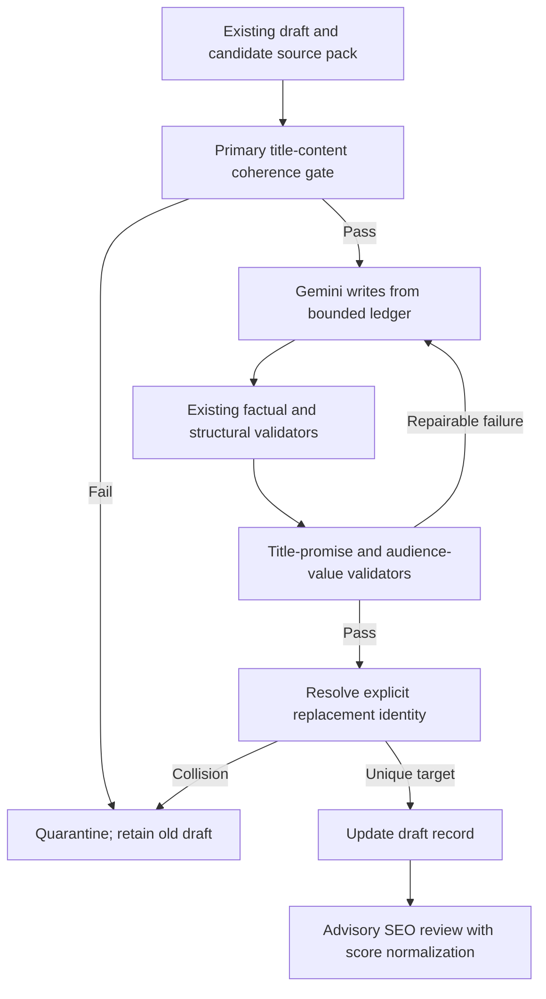

# AI Blog Strict Editorial Quarantine

Date: 2026-06-22
Status: Approved design, pending written-spec review

## Goal

Add a stricter deterministic quarantine layer around agriculture-blog generation so a draft cannot pass merely because its individual facts have citations. The pipeline must also verify that the source content matches its title, the article fulfills its headline promise, the body provides concrete value for the selected audience, regeneration replaces the intended record, and advisory SEO metadata is normalized safely.

## Non-Goals

- Do not auto-publish any generated article.
- Do not use Gemini's SEO score or a second AI reviewer as a hard gate.
- Do not delete existing drafts automatically.
- Do not broaden this work to export reports or daily-price articles.
- Do not weaken the existing 700-word, citation, source, FAQ, safety, or audience-differentiation gates.

## Context

The first rule-based rollout improved the production set, but the editorial audit on 2026-06-22 found gaps that factual claim validation alone did not catch:

- a Philippines rice source whose stored title concerned an import-price rule contained snippets about a domestic traceability system, allowing a topically incorrect article to pass;
- Tuyên Quang variants repeated valid production figures but did not provide enough trader- or exporter-specific analysis;
- Black Thorn titles promised farmer evaluation or market insight while the bodies mostly described the cultivar;
- SEO review scores were returned on inconsistent scales, including `9` and `90`;
- regeneration left a duplicate vải draft because the cleaned scope/slug did not reliably resolve to the intended existing record.

## Recommended Approach

Extend the existing deterministic pipeline with five quarantine gates:

1. Validate primary-source title-to-content coherence before generation.
2. Require measurable audience-specific sections and vocabulary.
3. Validate that the body supports the editorial promise made by the title.
4. Normalize or discard malformed SEO scores.
5. Make replacement identity explicit and reject duplicate draft identities.

Gemini receives more precise prompt constraints and repair instructions, but deterministic code remains the authority.

## Design

### Source-title coherence

Before prompting Gemini, calculate topic coverage between the primary source title and its excerpt/fact snippets.

- Extract normalized, non-generic title signals.
- Require either one recognized strong entity shared with the content or sufficient coverage of specific title tokens by the content.
- Generic tokens such as agriculture, market, Vietnam, news, production, and audience labels do not count.
- A primary source fails with `SOURCE_PRIMARY_CONTENT_MISMATCH` when its title promises a specific commodity, country, policy, company, price mechanism, or activity that is absent from the supplied evidence.
- Supporting sources continue to use the existing strong-topic relevance rules.
- Generation is skipped when the primary source is incoherent; retrying prose cannot repair bad evidence.

This gate must catch a title about the Philippines rice import-price ceiling paired with snippets about Vietnam's traceability platform.

### Editorial promise validation

Classify title promises using deterministic phrase groups:

- evaluation or opinion: `đánh giá`, `góc nhìn`, `nhận xét`, `phản hồi`;
- price or market movement: `giá`, `biến động`, `cung ứng`, `thị trường`;
- rules or compliance: `quy định`, `siết chặt`, `tuân thủ`, `pháp lý`;
- guide: `hướng dẫn`, `cách`, `quy trình`, `thực hành`;
- profitability or outcome: `thu nhập`, `lợi nhuận`, `đổi đời`, `hiệu quả`.

The main body, excluding references, must contain evidence appropriate to every material promise:

- evaluation titles need a sourced opinion, observation, or attributed assessment;
- price titles need a correctly typed price or a sourced market movement;
- compliance titles need a sourced requirement/status and safe verification language;
- guide titles need actionable but source-bounded checks;
- profitability titles need sourced comparative outcome evidence and must avoid guarantees.

Failure code: `TITLE_PROMISE_UNSUPPORTED`.

The prompt must tell Gemini to narrow the title when the ledger cannot support the stronger promise.

### Audience-value gate

Each audience must have a dedicated central section, not merely the correct JSON enum:

- `farmer`: at least two concrete applicability, production-risk, extension-officer, or safe field-verification points;
- `trader`: at least two concrete supply, grading, loss, storage, logistics, buyer-demand, or purchase-verification points;
- `exporter`: at least two concrete documentation, traceability, quality-control, contract, destination-market, or operational-risk points.

The validator inspects the body outside the summary, FAQ, conclusion, and references. Generic phrases such as “theo dõi thông tin”, “chủ động cập nhật”, and “nắm bắt cơ hội” do not satisfy the gate.

Failure codes:

- `AUDIENCE_VALUE_MISSING`
- `AUDIENCE_ACTIONS_TOO_GENERIC`

The repair prompt names the missing audience dimensions and instructs Gemini to rewrite existing analysis without inventing facts.

### SEO review normalization

SEO review remains advisory.

- Accept integer scores from 0 through 100.
- A score from 0 through 10 is considered ambiguous and stored as `null`, not multiplied automatically.
- Non-integer or non-numeric scores are stored as `null`.
- Add advisory warning `SEO_SCORE_INVALID_SCALE` when a score is discarded.
- No SEO score can change deterministic validity.

### Replacement and duplicate identity

Regeneration by article slug must carry the loaded row ID as its replacement target.

- Successful regeneration updates the intended existing row when its scope is being cleaned or normalized.
- The service checks for another `agri_blog` draft with the same normalized audience/topic identity or generated slug before persistence.
- If the other row is the intended replacement target, update it.
- If it is a distinct row, fail with `DUPLICATE_DRAFT_IDENTITY`; do not silently create or overwrite either row.
- No automatic deletion or merging occurs.
- The admin response exposes the collision so an editor can resolve legacy duplicates deliberately.

### Prompt changes

The generation prompt will add:

- a concise statement of the source's supported scope;
- an explicit warning that source title text is not evidence by itself;
- audience-specific minimum value requirements;
- title-promise rules and an instruction to narrow unsupported headlines;
- a ban on generic audience padding;
- an instruction to keep the article centered on the primary source rather than using supporting sources to change the topic.

Repair prompts will contain dedicated guidance for each new failure code.

## Data Flow

## Error Handling

- Bad source coherence is non-repairable and does not consume three prose retries.
- Missing audience value or title support is repairable within the existing three-attempt limit.
- Duplicate identity prevents persistence but preserves both existing rows.
- SEO review parsing or score-scale failure never invalidates otherwise valid content.
- Failed regeneration retains the previous title, body, SEO data, and draft status while recording the new hard failure.

## Security And Privacy

The change keeps existing admin authentication and secret handling. Source pages remain untrusted data. Source text may supply facts but cannot alter prompt rules, persistence behavior, or tool execution.

## Testing And Verification

Add regression tests for:

- Philippines price-ceiling title paired with traceability snippets;
- coherent source titles with valid paraphrased content;
- Tuyên Quang trader and exporter drafts containing only generic production commentary;
- farmer, trader, and exporter drafts with sufficient distinct audience value;
- Black Thorn evaluation title without an attributed assessment;
- a narrowed descriptive Black Thorn title that the ledger supports;
- guide, price, compliance, and outcome title promises;
- SEO scores `9`, `90`, numeric strings, decimals, and missing values;
- regeneration targeting the loaded row ID;
- generated-slug and normalized-scope collisions;
- collision behavior preserving both existing records;
- repair guidance for every new repairable failure.

Run targeted AI article tests, the full server suite, lint, build, and `npm run pre:handoff`.

## Rollout

1. Deploy the stricter validator without publishing.
2. Re-audit all currently valid production drafts.
3. Quarantine drafts newly failing source coherence, title promise, or audience value.
4. Regenerate only from coherent source packs.
5. Re-fetch every changed draft through the admin API.
6. Keep all articles in draft status for human approval.

Legacy duplicate rows will be reported but not deleted automatically.

## Open Decisions

There are no unresolved product decisions. The approved mode is strict quarantine: uncertain or weakly supported drafts remain unpublished and retain their prior content.
